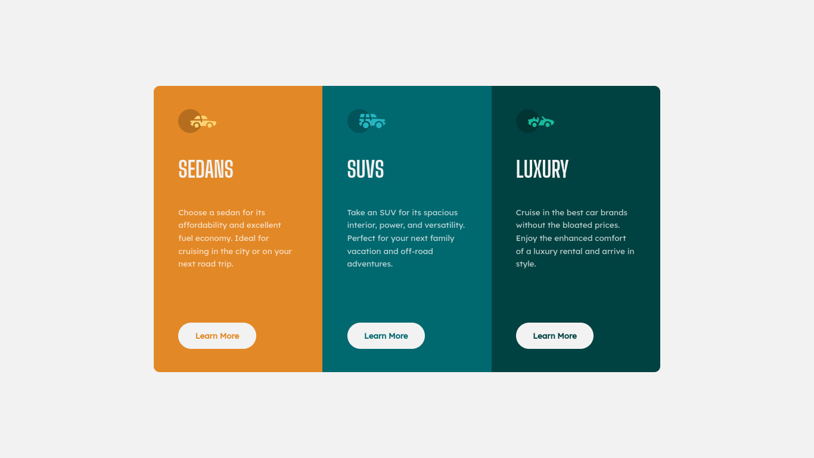

# Frontend Mentor - 3-column preview card component solution

This is a solution to the [3-column preview card component challenge on Frontend Mentor](https://www.frontendmentor.io/challenges/3column-preview-card-component-pH92eAR2-). Frontend Mentor challenges help you improve your coding skills by building realistic projects. 

## Table of contents

- [Frontend Mentor - 3-column preview card component solution](#frontend-mentor---3-column-preview-card-component-solution)
  - [Table of contents](#table-of-contents)
  - [Overview](#overview)
    - [Screenshot](#screenshot)
    - [Links](#links)
  - [My process](#my-process)
    - [Built with](#built-with)
    - [What I learned](#what-i-learned)
    - [Continued development](#continued-development)
  - [Author](#author)

## Overview

### Screenshot

Desktop View

Mobile View

### Links

- [Solution URL](https://github.com/reza-sjdn/3-column-preview-card-component)
- [Live Demo](https://reza-sjdn.github.io/3-column-preview-card-component)

## My process

### Built with

- Semantic HTML5 markup
- CSS custom properties
- Flexbox
- Mobile-first workflow

### What I learned

- Set a border to a button even as the same color as the button background!
  This way you control some odd behaviour when hovering.

- Check the responsibility always in a slow transition!

- `h1` is the main header and there must be just one `h1` element in the whole page.
   for this project use `h2` for headers.

### Continued development

I must go deeper in `border-radius`. I'm gonna study an article in MDN.

## Author

- Frontend Mentor - [@reza-sjdn](https://www.frontendmentor.io/profile/reza-sjdn)
- Twitter - [@reza_sjdn](https://www.twitter.com/reza_sjdn)
- Telegram - [@reza_sjdn80]
